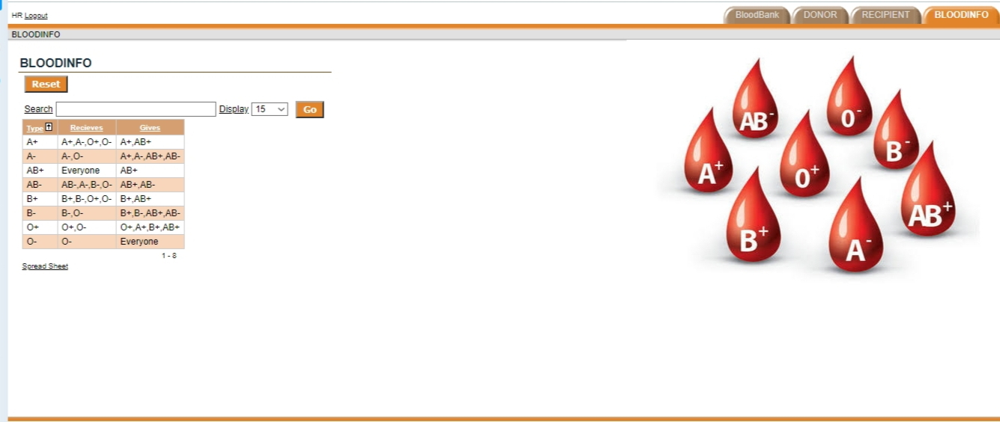

## Bloodbank Management System🗒
* Front end - Oracle Application Express(Webapp)
* Back end - SQL(Structured Query Language)

**Operations - CRUD** 🔶
* Create 
* Read
* Update 
* Delete 

### Working ⬇️

### Usage  ✅

* Information can be easily managed by staffs of BloodBank.
* Website that stores information about Blood Donation importance, including Recipient's data, Donor's data and Compatible Blood Types
* Can add more Features as per Requirements in future.. 
